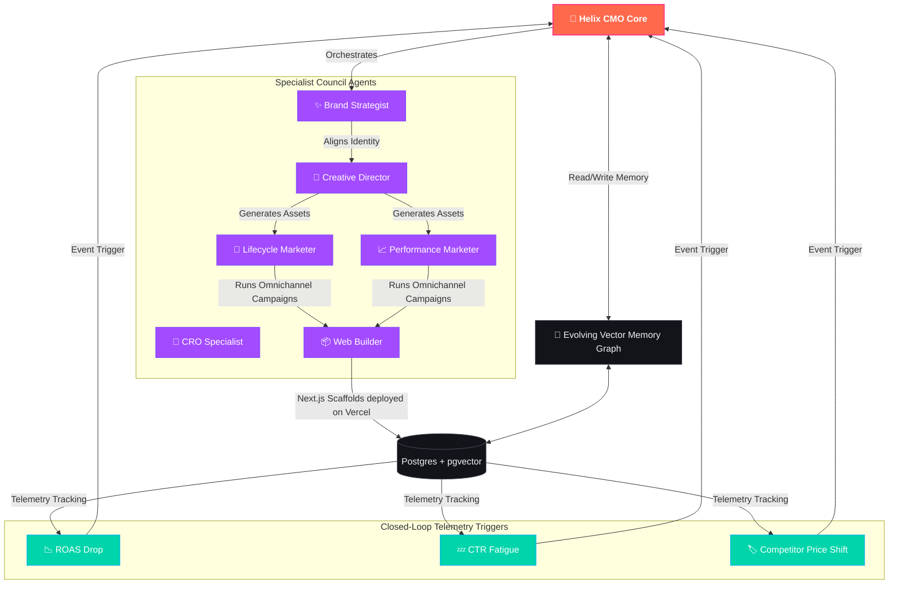

<p align="center">
  
</p>

<h1 align="center">Helix 🧬</h1>

<p align="center">
  <a href="https://github.com/Mysterio6193/Helix"></a>
  <a href="https://github.com/Mysterio6193/Helix/blob/main/LICENSE"></a>
  <a href="https://github.com/Mysterio6193/Helix"></a>
  <a href="https://github.com/Mysterio6193/Helix"></a>
  <a href="https://github.com/Mysterio6193/Helix"></a>
  <a href="https://github.com/Mysterio6193/Helix"></a>
</p>

<p align="center">
  
  
  
  
  
  
  
  
  
</p>

---

**Helix is an AI-native commerce operating system: an autonomous CMO, creative agency, growth team, and operator unified under a single stunning surface.**

Unlike traditional prompt playgrounds or generic chatbots, Helix is fully goal-oriented and event-driven. Users define brand identities, **76+ API integrations**, constraints, and key performance indicators (KPIs). Helix then autonomously plans, renders creative assets, deploys websites, executes marketing campaigns, monitors performance, and continuously optimizes operations using closed-loop learning.

---

## 🎨 Product Surfaces

<table>
<tr>
  <td width="30%"><b>Command Center</b></td>
  <td>Unified AI CMO dashboard to launch workflows, check health, and track brand growth.</td>
</tr>
<tr>
  <td><b>Executive Council</b></td>
  <td>An ensemble of specialized agents collaborating dynamically to review and critique campaigns.</td>
</tr>
<tr>
  <td><b>Campaign Manager</b></td>
  <td>Omnichannel coordinator orchestrating launches across Email, Social, and Storefronts.</td>
</tr>
<tr>
  <td><b>Creative Studio</b></td>
  <td>A live-preview collaborative canvas to critique and refine visual design assets.</td>
</tr>
<tr>
  <td><b>Website Builder</b></td>
  <td>Instant generation of restaurant and food brand sites deployed directly to <b>Vercel</b>.</td>
</tr>
<tr>
  <td><b>Packaging Workspace</b></td>
  <td>SKU and packaging suite generator creating print-ready label specifications.</td>
</tr>
<tr>
  <td><b>Performance Memory</b></td>
  <td>An evolving vector memory graph storing style presets, past outcomes, and learnings.</td>
</tr>
<tr>
  <td><b>Automations Console</b></td>
  <td>Event-driven timeline triggered by ROAS drops, CTR fatigue, or competitor price changes.</td>
</tr>
</table>

---

## 🔌 Integration Platform

Helix ships with **76+ real API integrations** — no mocks, no demo data, no silent degradation. Every adapter makes real HTTP calls or fails with a clear error message.

| Category | Providers |
|---|---|
| **Messaging & Chat** | Slack, Discord, WhatsApp Business, Telegram, Meta Pages, Instagram |
| **Restaurant & POS** | Toast, Square, DoorDash, UberEats, Yelp, Petpooja, Clover, Lightspeed, Revel, ChowNow, Ordermark, Slice |
| **E-commerce & Payments** | Shopify, WooCommerce, Stripe, PayPal, QuickBooks, Squarespace, Wix, BigCommerce, TikTok Shop |
| **Marketing & CRM** | Mailchimp, Klaviyo, HubSpot, SendGrid, Google Business, LinkedIn, Meta Ads, Google Ads, Snapchat Ads, Reddit Ads, Semrush, Ahrefs, Google Search Console |
| **CRM & Support** | Salesforce, Zendesk, Intercom, Jira, Zoho CRM |
| **Social Media** | Twitter/X, TikTok, Pinterest, Threads, YouTube |
| **Analytics & Data** | GA4, PostHog, Mixpanel, Segment, Amplitude, Google Search Console |
| **Productivity & Ops** | Airtable, Linear, Asana, Calendly, Notion, Figma, Canva, Microsoft 365, Typeform, Webflow, Framer, Loom, Google Calendar |
| **Finance & Accounting** | Zoho Books, Zoho Subscriptions, QuickBooks |
| **Zoho Suite** | Zoho CRM, Zoho Books, Zoho Campaigns, Zoho Desk, Zoho Inventory, Zoho Subscriptions, Zoho Projects |
| **Reservations** | Resy, OpenTable |
| **Infrastructure** | AWS, Vercel, GitHub |

Features:
- **Token health monitoring** — `/integrations/health` endpoint checks every connected provider with real API calls
- **MCP Protocol Support** — JSON-RPC 2.0 with SSE and stdio transports for AI client tool access
- **Consistent adapter pattern** — `resolve creds → validate → API call → ToolResult`, every adapter the same
- **Byok-ready** — providers accept user-supplied API tokens with per-key validation

---

## 🚀 Core Capabilities

*   **Persistent Specialist Agents** — Dedicated agents for creative design, copywriting, SEO, CRO, research, and web engineering.
*   **Event-Driven Autonomy** — Proactive responses to real-world triggers like declining conversion rates, visual fatigue, and competitor moves.
*   **Durable Workflow Execution** — Composed execution graphs with checkpoints, retries, replayable action logs, and step-by-step inspections.
*   **Creative Intelligence** — Automated aesthetic scoring, visual fatigue detection, layout quality assessments, and style guide consistency.
*   **Closed-Loop Experimentation** — Built-in A/B matrix testing, automated confidence scoring, and smart winner selection rollouts.
*   **Zero-Friction Sandbox Demo** — Complete frontend fallback that simulates full dashboard operations when backend databases or APIs are offline.

---

## ⚙️ Closed-Loop Workflow Architecture

The Mermaid diagram below visualizes the **Helix Event-Driven Closed-Loop Operating Cycle**, mapping how telemetry anomalies trigger autonomous specialist agents to execute marketing revisions and update our long-term memory graph:



---

## 🤖 Supported Models

Helix features an advanced LLM Gateway supporting **60+ models across 11 major providers**. Users can bring their own API keys via `/settings/provider-keys` for local execution or cloud dispatch.

| Provider | Supported Models |
|----------|------------------|
| **OpenAI** | GPT-5.5 (Peak Reasoning), o3 & o4-mini (Advanced STEM), GPT-4o, o1, DALL-E 3 |
| **Anthropic** | Claude Opus 4.7 (Long Planning), Sonnet 4.7 & 4.5, Haiku 4.5 |
| **Google** | Gemini 3.5 Pro (1M Context), 2.5 Flash, 2.0 Flash, Imagen 3, Veo 2 |
| **DeepSeek** | DeepSeek R1 (Full Reasoning), DeepSeek V3 |
| **OpenRouter** | DeepSeek R1/V3, Llama 3.3 70B, Qwen 2.5 Coder, Mistral Large 3, etc. |
| **DashScope** | Qwen 3.7 Max, Qwen Max/Plus/Turbo, Qwen3-235B |
| **Groq** | Llama 3.3 70B, DeepSeek R1 Distill 70B, Qwen 2.5 32B |
| **Runway / Replicate** | Gen-3 video generation, custom AI image filters |

---

## ⚡ Interactive Offline Sandbox Mode

Helix features a **Zero-Friction Sandbox Demo Mode**. If you are evaluating a standalone frontend deployment (e.g. on Vercel preview environments) or your local backend API is offline, credentials submission automatically routes you into Sandbox Mode:
* **Legible Features page** — Faint background glows and high-contrast card structures ensure text is easily readable under all light conditions.
* **Realistic Failovers** — API connections failover gracefully to present a fully interactive dashboard displaying pre-configured workspaces, mock brands, recent campaigns, asset lists, and operating council maps.
* **Safe Sessions** — Explore and test pages freely without backend constraints. Logging out securely clears your sandbox credentials from `localStorage`.

---

## 🛠️ Local Development

### Prerequisites
* Node.js 18+ & `pnpm` 9+ (or `npm` / `yarn`)
* Python 3.11+
* Docker & Docker Compose

### Step 1: Install Dependencies
```bash
pnpm install
```

### Step 2: Spin Up Infrastructure
```bash
cd infra
docker compose up -d postgres redis minio
cd ..
```

### Step 3: Set Up and Run the API
```bash
cd apps/api
python3 -m venv .venv
source .venv/bin/activate
pip install -e ".[dev]"
cp ../../.env.example .env   # Configure with your keys
alembic upgrade head
uvicorn helix.main:app --host 0.0.0.0 --port 8000 --reload
```

### Step 4: Run Background Workers
In a separate terminal tab:
```bash
cd apps/api
source .venv/bin/activate
python -m apps.workers.run_worker
```

### Step 5: Start the Web Dashboard
In a separate terminal tab:
```bash
cd apps/web
pnpm dev
```

The system will be accessible locally at **[http://localhost:3000](http://localhost:3000)** (or port `3001` if port `3000` is active).

---

## 📖 Project Documentation

*   **[ARCHITECTURE.md](ARCHITECTURE.md)** — Architectural layout, runtime loops, and design decisions.
*   **[DEPLOY.md](DEPLOY.md)** — Complete production deployment guide (Fly.io, Render, Vercel).
*   **[CONTRIBUTING.md](CONTRIBUTING.md)** — Contribution pathways, PR criteria, and conventions.
*   **[CHANGELOG.md](CHANGELOG.md)** — Core development phases and features history.

---

## 🏗️ Repository Structure

```
helix/
├── apps/
│   ├── api/              # Python FastAPI backend (helix/)
│   │   ├── helix/
│   │   │   ├── api/      # FastAPI route modules
│   │   │   ├── tools/    # Tool adapter system (76+ adapters)
│   │   │   ├── agents/   # LangGraph agent orchestration
│   │   │   ├── llm/      # LLM gateway (60+ models)
│   │   │   └── services/ # Business logic + integration health
│   ├── web/              # Next.js 15 frontend
│   └── workers/          # Background workers
├── packages/
│   ├── types/            # Shared TypeScript types
│   └── vendor/           # Vendored third-party packages
├── skills/               # 116 marketing/creative skills
├── design-systems/       # 50 design system definitions
├── infra/                # Docker, Postgres configs
└── .planning/            # Development roadmap & plans
```

---

<p align="center">
  <sub>Built with ❤️ for brands that move at light speed. Licensed under the MIT License.</sub>
</p>
